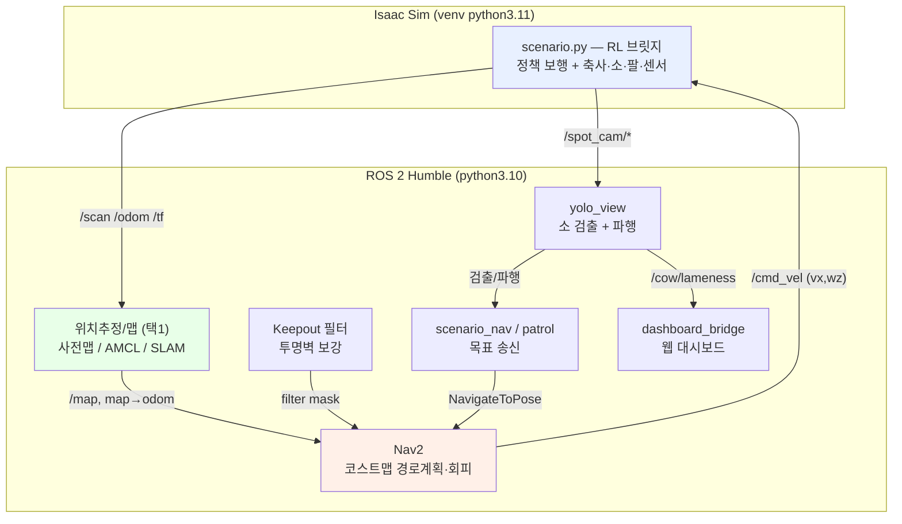

# 🐄 스마트 축사 자율순찰 로봇 "꼬마 두리"

Boston Dynamics **Spot + 팔** 로봇으로 축사를 자율 순찰하며 소를 검출·검사하는 시스템.
**Isaac Sim 5.1 + ROS 2 Humble** 기반. **순찰 → 소 검출 → 소 후방(꼬리쪽) 접근 → 검사** 시나리오.

---

## 1. 주요 기능

| 기능 | 설명 |
|------|------|
| **RL 자율 보행** | 무팔 평면정책(`spot_flat`)으로 다리 12관절 보행. 넘어짐 복구·시작 안정화 |
| **자율 주행 (Nav2)** | 코스트맵 경로계획 + 장애물 회피. 후진금지(전진형) 주행 |
| **위치추정 3모드** | ① 사전맵+정위치 ② AMCL ③ SLAM/복합(slam_toolbox) 선택 |
| **투명벽 회피** | 라이다 미감지 가상벽을 Keepout 필터로 코스트맵에 강제 |
| **소 검출 + 파행** | YOLO-Pose(14키포인트)로 소 검출·거리, 키포인트 비대칭 파행 지표(`/cow/lameness`) |
| **소 후방 접근** | 검출 → 꼬리 1.5m 뒤로 NavigateToPose 이동 |
| **순찰** | 축사 통로 끝 전부 자동 순회 |
| **웹 대시보드** | FastAPI+MQTT+SQLite — 감지·카메라·순찰·비상정지 |
| **4뷰 헤드리스 녹화** | 축사사선/로봇체이스/손카메라/탑다운맵 mp4 동시 녹화 |
| **다중 속도 중재** | twist_mux 우선순위 중재 + 비상정지(e_stop) |

---

## 2. 시스템 설계 (플로우차트)



**폐루프**: Nav2 경로 → `/cmd_vel` → RL 보행 → 로봇 이동 → `/scan·/odom` → 위치추정/맵 갱신 → Nav2 재계획.
**핵심 분리**: Nav2는 목표속도만 지시, 실제 다리 보행은 RL이 담당.

> 상세 다이어그램(상태머신·시퀀스·컴포넌트)은 [`SYSTEM_ARCHITECTURE.md`](SYSTEM_ARCHITECTURE.md), 아키텍처 요약은 [`src/smart_farm_spot/ARCHITECTURE.md`](src/smart_farm_spot/ARCHITECTURE.md) 참조.

---

## 3. 운영체제 / 소프트웨어 환경

| 항목 | 버전 |
|------|------|
| OS | Ubuntu 22.04 LTS (Linux 6.8) |
| ROS 2 | Humble Hawksbill |
| 시뮬레이터 | NVIDIA Isaac Sim **5.1** + Isaac Lab |
| Python | 3.10 (ROS 측) / 3.11 (Isaac venv) |
| Nav2 | navigation2 (Humble) |
| SLAM | slam_toolbox (2D) |
| 도메인 | `ROS_DOMAIN_ID=153` |

---

## 4. 사용 장비 (시뮬레이션)

| 구분 | 장비 |
|------|------|
| 로봇 | Boston Dynamics **Spot + Arm** (USD 모델) |
| 라이다 | RTX Lidar — `Example_Rotary_2D` (360° 2D LaserScan, 마운트 0.55m) |
| 카메라 | Intel RealSense **D455** (손끝, RGB-D 320×320) → `/spot_cam/*` |
| 실행 H/W | NVIDIA GeForce **RTX 5080 Laptop** (16GB) — Isaac Sim 구동 |

> 실 로봇 없이 Isaac Sim 시뮬레이션으로 동작(sim-only).

---

## 5. 의존성

- **Python 패키지**: [`requirements.txt`](requirements.txt) (`pip install -r requirements.txt`)
  - ⚠️ **numpy 는 반드시 <2** — ROS cv_bridge/matplotlib 가 numpy 1.x ABI
- **웹 대시보드**: [`dashboard/requirements.txt`](dashboard/requirements.txt) (fastapi, uvicorn, paho-mqtt …)
- **ROS 2(apt)**: `ros-humble-{navigation2,nav2-bringup,slam-toolbox,twist-mux,cv-bridge}`
- **Isaac Sim/Lab**: 별도 venv(`~/dev_ws/venv/isaaclab`) — IsaacLab 공식 설치

---

## 6. 실행 순서

### 빌드 (최초 1회)
```bash
cd ~/dev_ws/spot_ws
source /opt/ros/humble/setup.bash
colcon build --packages-select smart_farm_spot
source install/setup.bash
export ROS_DOMAIN_ID=153
```

### A. 전체 시나리오 (한 스크립트가 1~5단계 오케스트레이션)
```bash
# 위치추정 모드 택1
bash src/smart_farm_spot/scripts/run_scenario.sh          # ① 사전맵+정위치 (기본)
bash src/smart_farm_spot/scripts/run_scenario_amcl.sh     # ② AMCL
SF_SLAM_MODE=mapping bash src/smart_farm_spot/scripts/run_scenario_slam.sh   # ③ SLAM
```
스크립트 내부 단계: `[1] Isaac 브릿지 → [2] /scan 대기 → [3] 맵(사전맵/AMCL/SLAM) → [4] Nav2 + Keepout → [5] YOLO + 목표주행`
옵션: `SF_PATROL=1`(순찰) · `SF_VISION_TAIL=1`(비전목표) · `SF_KEEPOUT=0`(끄기)

### B. ROS 2 기능 통합 launch (Isaac은 별도 기동 시)
```bash
ros2 launch smart_farm_spot bringup.launch.py \
    patrol:=true twist_mux:=true dashboard:=true keepout:=true yolo:=true
```

### C. 웹 대시보드
```bash
cd dashboard && cp -n .env.example .env
ROS_DOMAIN_ID=153 python3 -m uvicorn server:app --port 5000   # localhost:5000 (admin/changeme)
```

### D. 4뷰 헤드리스 녹화 (Isaac venv)
```bash
source ~/dev_ws/venv/isaaclab/bin/activate && cd ~/dev_ws/isaac_sim/IsaacLab
SF_HEADLESS=1 SF_OUT_DIR=~/rag/demo SF_REC_RES=1280,640 \
    ./isaaclab.sh -p ~/dev_ws/spot_ws/src/smart_farm_spot/isaac/record_4cam.py
```

### 검출 화면 보기
```bash
ROS_DOMAIN_ID=153 rqt_image_view /yolo/annotated
```

---

## 7. 디렉터리 구조

```
spot_ws/
├── README.md  ·  requirements.txt  ·  SYSTEM_ARCHITECTURE.md  ·  TODO.md
├── dashboard/                       # 웹 대시보드 (FastAPI+MQTT+SQLite)
└── src/smart_farm_spot/             # ROS 2 패키지
    ├── isaac/                       # Isaac Sim 실행 (scenario.py, record_4cam.py …)
    ├── launch/                      # bringup, nav2(_amcl/_flat), keepout, spot_slam …
    ├── config/                      # nav2_params(_slam/_amcl), twist_mux, waypoints …
    ├── scripts/                     # run_scenario(_amcl/_slam).sh
    ├── maps/                        # 점유격자 + keepout 마스크
    ├── assets/                      # USD 씬·로봇·소·텍스처 + 정책(policy.pt)·YOLO(best.pt)
    ├── tools/                       # check_twist_mux, make_keepout_mask, gen_random_waypoints
    └── *.py                         # yolo_view, scenario_nav, patrol, barn_map_server …
```
