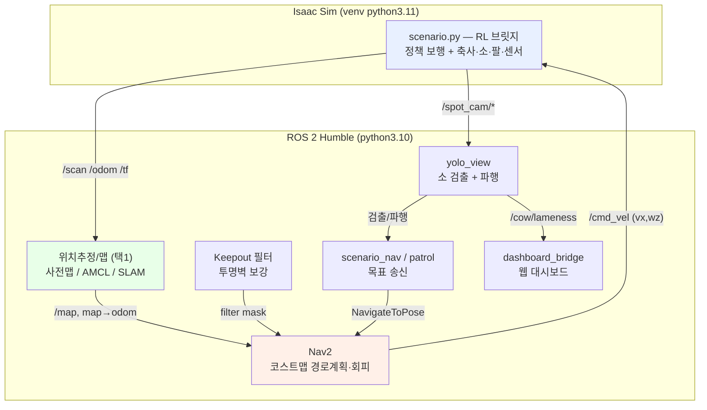

# 🐄 스마트 축사 자율순찰 로봇 "꼬마 두리"

Boston Dynamics **Spot + 팔** 로봇으로 축사를 자율 순찰하며 소를 검출·검사하는 시스템.
**Isaac Sim 5.1 + ROS 2 Humble** 기반. **순찰 → 소 검출 → 소 후방(꼬리쪽) 접근 → 검사** 시나리오.

---

## 👤 담당 역할

이 프로젝트는 5인 팀 프로젝트이며, 저는 다음 부분을 담당했습니다.

- **3D 에셋 소싱** — 소(Holstein) 모델(애니메이션 포함), 축사 건물 모델 탐색 및 제공
- **웹 대시보드 영상 스트리밍** — Isaac Sim 영상을 ROS2 토픽으로 발행, 두 대의 Ubuntu 노트북 간 네트워킹, FastAPI 기반 웹 대시보드에 영상 표시

RL 자율 보행, Nav2 주행, SLAM/위치추정, YOLO-Pose 소 검출, twist_mux 속도 중재 등 
나머지 구현 부분은 다른 팀원들이 담당했습니다.

## ⚠️ 프로젝트 진행 상황 및 한계

본 README에 기재된 기능들은 설계 및 부분 구현 수준이며, 시간 제약으로 인해 
전체 시스템이 의도대로 완성되지는 못했습니다.

- ❌ **로봇 제어**: RL 보행 정책 학습에 실패하여 로봇이 실제로 동작하지 않음
- ✅ **대시보드 (담당 파트)**: ROS2 토픽 송수신(노트북 간 네트워킹), FastAPI를 통한 웹 브라우저 영상 표시는 정상 동작
- ❌ **대시보드 카메라 시점 (담당 파트)**: Isaac Sim 씬에 카메라(Camera prim)를 명시적으로 생성하지 않아, 의도한 로봇 시점이 아닌 사용자 뷰포트 화면이 표시됨

## 🛠️ 트러블슈팅 (담당 파트)

- **Isaac Sim 카메라 시점 미스매치** — ROS2 토픽을 구독해 웹 대시보드에 영상을 스트리밍했으나, 
  Isaac Sim 씬에 카메라(Camera prim)를 명시적으로 생성하지 않아 의도한 카메라 시점이 아닌 
  사용자 뷰포트 화면이 전송되는 문제 발생. 원인은 파악했으나(카메라 prim 생성 및 ROS2 
  Camera Helper 연결 누락), 시간 제약으로 완료하지 못함

---

## 1. 주요 기능

| 기능 | 설명 |
|------|------|
| **RL 자율 보행** | 무팔 평면정책(`spot_flat`)으로 다리 12관절 보행. 넘어짐 복구·시작 안정화 |
| **자율 주행 (Nav2)** | 코스트맵 경로계획 + 장애물 회피. 후진금지(전진형) 주행 |
| **위치추정 3모드** | ① 사전맵+정위치 ② AMCL ③ SLAM/복합(slam_toolbox) 선택 |
| **투명벽 회피** | 라이다 미감지 가상벽을 Keepout 필터로 코스트맵에 강제 |
| **소 검출 + 파행** | YOLO-Pose(14키포인트)로 소 검출·거리, 키포인트 비대칭 파행 지표(`/cow/lameness`) |
| **소 후방 접근** | 검출 → 꼬리 1.5m 뒤로 NavigateToPose 이동 |
| **순찰** | 축사 통로 끝 전부 자동 순회 |
| **웹 대시보드** | FastAPI+MQTT+SQLite — 감지·카메라·순찰·비상정지 |
| **4뷰 헤드리스 녹화** | 축사사선/로봇체이스/손카메라/탑다운맵 mp4 동시 녹화 |
| **다중 속도 중재** | twist_mux 우선순위 중재 + 비상정지(e_stop) |

---

## 2. 시스템 설계 (플로우차트)



**폐루프**: Nav2 경로 → `/cmd_vel` → RL 보행 → 로봇 이동 → `/scan·/odom` → 위치추정/맵 갱신 → Nav2 재계획.
**핵심 분리**: Nav2는 목표속도만 지시, 실제 다리 보행은 RL이 담당.

> 상세 다이어그램(상태머신·시퀀스·컴포넌트)은 [`SYSTEM_ARCHITECTURE.md`](SYSTEM_ARCHITECTURE.md), 아키텍처 요약은 [`src/smart_farm_spot/ARCHITECTURE.md`](src/smart_farm_spot/ARCHITECTURE.md) 참조.

---

## 3. 운영체제 / 소프트웨어 환경

| 항목 | 버전 |
|------|------|
| OS | Ubuntu 22.04 LTS (Linux 6.8) |
| ROS 2 | Humble Hawksbill |
| 시뮬레이터 | NVIDIA Isaac Sim **5.1** + Isaac Lab |
| Python | 3.10 (ROS 측) / 3.11 (Isaac venv) |
| Nav2 | navigation2 (Humble) |
| SLAM | slam_toolbox (2D) |
| 도메인 | `ROS_DOMAIN_ID=153` |

---

## 4. 사용 장비 (시뮬레이션)

| 구분 | 장비 |
|------|------|
| 로봇 | Boston Dynamics **Spot + Arm** (USD 모델) |
| 라이다 | RTX Lidar — `Example_Rotary_2D` (360° 2D LaserScan, 마운트 0.55m) |
| 카메라 | Intel RealSense **D455** (손끝, RGB-D 320×320) → `/spot_cam/*` |
| 실행 H/W | NVIDIA GeForce **RTX 5080 Laptop** (16GB) — Isaac Sim 구동 |

> 실 로봇 없이 Isaac Sim 시뮬레이션으로 동작(sim-only).

---

## 5. 의존성

- **Python 패키지**: [`requirements.txt`](requirements.txt) (`pip install -r requirements.txt`)
  - ⚠️ **numpy 는 반드시 <2** — ROS cv_bridge/matplotlib 가 numpy 1.x ABI
- **웹 대시보드**: [`dashboard/requirements.txt`](dashboard/requirements.txt) (fastapi, uvicorn, paho-mqtt …)
- **ROS 2(apt)**: `ros-humble-{navigation2,nav2-bringup,slam-toolbox,twist-mux,cv-bridge}`
- **Isaac Sim/Lab**: 별도 venv(`~/dev_ws/venv/isaaclab`) — IsaacLab 공식 설치

---

## 6. 실행 순서

### 빌드 (최초 1회)
```bash
cd ~/dev_ws/spot_ws
source /opt/ros/humble/setup.bash
colcon build --packages-select smart_farm_spot
source install/setup.bash
export ROS_DOMAIN_ID=153
```

### A. 전체 시나리오 (한 스크립트가 1~5단계 오케스트레이션)
```bash
# 위치추정 모드 택1
bash src/smart_farm_spot/scripts/run_scenario.sh          # ① 사전맵+정위치 (기본)
bash src/smart_farm_spot/scripts/run_scenario_amcl.sh     # ② AMCL
SF_SLAM_MODE=mapping bash src/smart_farm_spot/scripts/run_scenario_slam.sh   # ③ SLAM
```
스크립트 내부 단계: `[1] Isaac 브릿지 → [2] /scan 대기 → [3] 맵(사전맵/AMCL/SLAM) → [4] Nav2 + Keepout → [5] YOLO + 목표주행`
옵션: `SF_PATROL=1`(순찰) · `SF_VISION_TAIL=1`(비전목표) · `SF_KEEPOUT=0`(끄기)

### B. ROS 2 기능 통합 launch (Isaac은 별도 기동 시)
```bash
ros2 launch smart_farm_spot bringup.launch.py \
    patrol:=true twist_mux:=true dashboard:=true keepout:=true yolo:=true
```

### C. 웹 대시보드
```bash
cd dashboard && cp -n .env.example .env
ROS_DOMAIN_ID=153 python3 -m uvicorn server:app --port 5000   # localhost:5000 (admin/changeme)
```

### D. 4뷰 헤드리스 녹화 (Isaac venv)
```bash
source ~/dev_ws/venv/isaaclab/bin/activate && cd ~/dev_ws/isaac_sim/IsaacLab
SF_HEADLESS=1 SF_OUT_DIR=~/rag/demo SF_REC_RES=1280,640 \
    ./isaaclab.sh -p ~/dev_ws/spot_ws/src/smart_farm_spot/isaac/record_4cam.py
```

### 검출 화면 보기
```bash
ROS_DOMAIN_ID=153 rqt_image_view /yolo/annotated
```

---

## 7. 디렉터리 구조

```
spot_ws/
├── README.md · requirements.txt · SYSTEM_ARCHITECTURE.md
├── TEST_COVERAGE_ANALYSIS.md · TODO.md
├── dashboard/                        # 웹 대시보드 (FastAPI + MQTT + SQLite)
│   ├── server.py                     # FastAPI 앱 진입점
│   ├── ros2_bridge.py                # ROS 2 → MQTT 브리지
│   ├── mqtt_client.py · camera_stream.py · database.py
│   ├── detect_mastitis.py · mock_sim.py · test_mastitis.py
│   ├── mosquitto.conf · docker-compose.yml · Dockerfile · requirements.txt
│   ├── routes/                       # camera.py · detection.py · edr.py · robot.py
│   └── templates/                    # dashboard.html · camera.html · edr.html · login.html
└── src/smart_farm_spot/              # ROS 2 패키지
    ├── package.xml · setup.cfg · setup.py
    ├── ARCHITECTURE.md · README.md
    ├── *.py                          # ROS 2 노드
    │                                 #   yolo_view, yolo_record, scenario_nav, patrol,
    │                                 #   barn_map_server, cow_tracker, cow_tail_seek,
    │                                 #   nav_to_cow, dashboard_bridge, h_drive,
    │                                 #   arm_mass, arm_poses, inspect_sequence,
    │                                 #   inspection_capture
    ├── assets/                       # 모델·정책·YOLO 가중치
    │   ├── policy/                   # policy.pt · policy_no_arm_bast.pt · *.onnx
    │   ├── robot/                    # spot_with_arm.usd
    │   ├── scene/                    # environment_*.usd · textures/ · models/ · props/
    │   └── yolo/                     # best.pt (YOLO-Pose 가중치)
    ├── config/                       # 파라미터·웨이포인트·RViz 설정
    │   ├── nav2_params.yaml · nav2_params_amcl.yaml
    │   ├── nav2_params_flat.yaml · nav2_params_slam.yaml
    │   ├── keepout_filter.yaml · twist_mux.yaml · scenario_modes.yaml
    │   ├── waypoints.yaml · waypoints_diag.yaml · waypoints_h.yaml
    │   └── scenario.rviz · slam_view.rviz
    ├── docs/                         # 통합·실행·브리지 가이드 문서
    │   ├── ASSETS.md · INTEGRATION.md · ROS2_BRIDGE_GUIDE.md · RUN_GUIDE.md
    │   └── README.md
    ├── isaac/                        # Isaac Sim 실행 스크립트 (venv python3.11)
    │   ├── scenario.py               # 메인 RL 브리지 (진입점)
    │   ├── record_4cam.py            # 4뷰 헤드리스 녹화
    │   ├── nav_policy_bridge.py · nav_policy_slam_bridge.py · nav_bridge.py
    │   ├── scene_setup.py · add_sensors.py · setup_semantics.py
    │   ├── camera_record.py · capture_check.py · drive_course.py
    │   ├── isaac_sim_bridge.py · ros_bridge_test.py · view_scene.py
    │   └── scenario1/                # 초기 시나리오 아카이브
    ├── launch/                       # ROS 2 launch 파일
    │   ├── bringup.launch.py         # 통합 기동 (patrol·twist_mux·dashboard·keepout·yolo)
    │   ├── keepout.launch.py
    │   ├── nav2_amcl.launch.py · nav2_flat.launch.py
    │   └── spot_nav2.launch.py · spot_slam.launch.py · spot_slam_loc.launch.py
    ├── maps/                         # 점유격자 + keepout 마스크
    │   ├── environment_0609.{png,yaml} · environment_final.{png,yaml}
    │   ├── keepout_mask.{pgm,yaml}   # make_keepout_mask.py 로 재생성 가능
    │   └── backup/
    ├── resource/                     # ROS 2 ament 리소스 마커
    ├── scripts/                      # 오케스트레이션 셸 스크립트
    │   ├── run_scenario.sh           # ① 사전맵+정위치 (기본)
    │   ├── run_scenario_amcl.sh      # ② AMCL
    │   ├── run_scenario_slam.sh      # ③ SLAM
    │   └── run_slam_nav.sh · run_local.sh · run_server.sh
    ├── smart_farm_spot/              # Python 패키지 (ament install)
    │   └── waypoint_patrol.py
    ├── test/                         # 단위 테스트 (pytest)
    │   └── test_{arm_mass,arm_poses,cow_tracker,dashboard_bridge,
    │           inspection_capture,inspect_sequence,keepout_mask}.py
    ├── tools/                        # 개발 유틸리티
    │   └── check_twist_mux.py · check_warmstart.py · make_keepout_mask.py
    └── wip/                          # 개발 중 (미완성)
        └── thermal_processor.py
```
