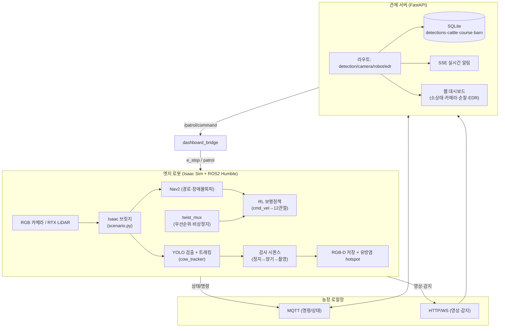
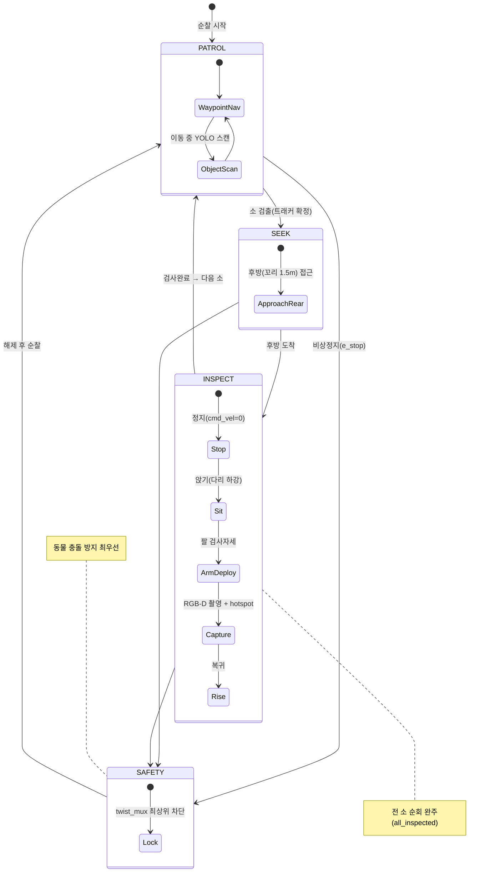
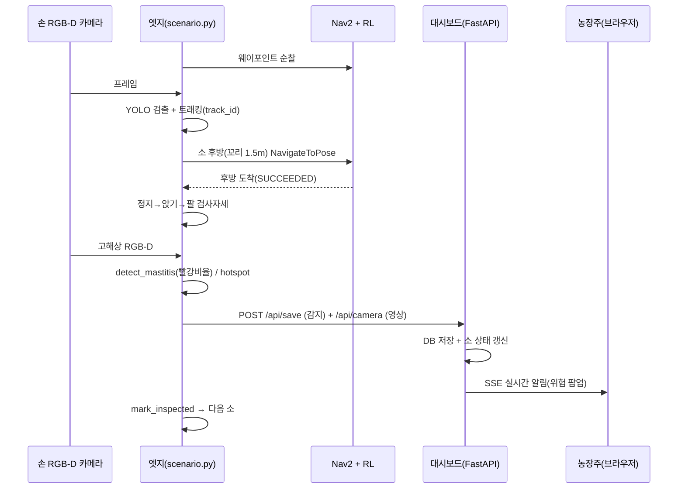
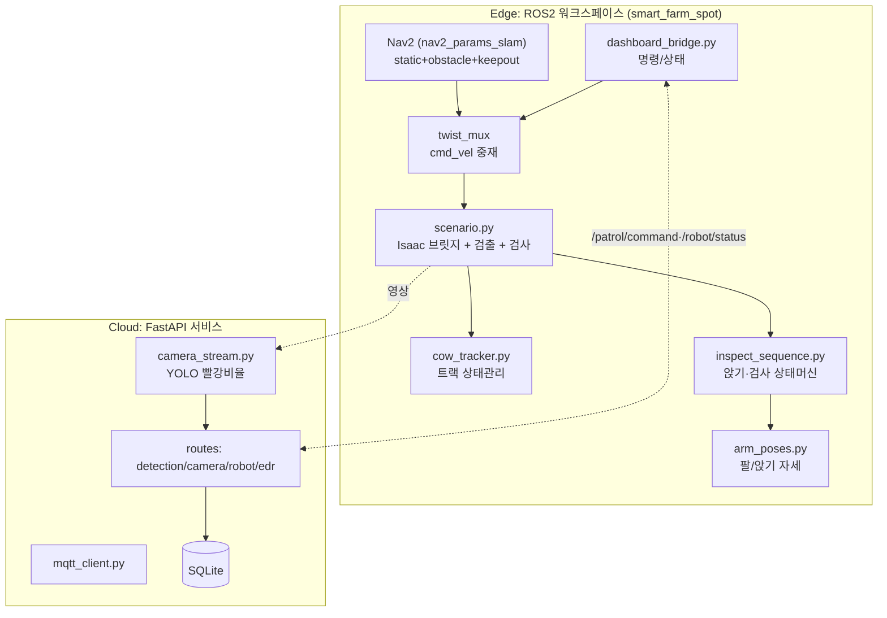
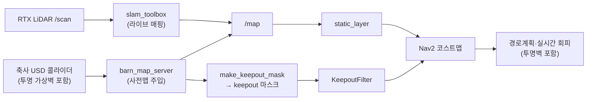

# 시스템 아키텍처 — 스마트 축사 자율순찰 로봇 (구현 기준)

> 본 문서는 **실제 구현된 시스템** 아키텍처입니다. (설계 스펙 `System_Architecture_Detailed_Spec.md` 대비
> 일부 항목은 구현이 다름 — §8 차이표 참고.)

## 1. 개요
4족 로봇(Spot)이 Isaac Sim 축사를 **자율 순찰**하며 소를 **검출·검사**하고, 결과를 **웹 대시보드**로
관제하는 엣지–관제 통합 시스템. 엣지(로봇)=경량 검출, 관제(서버)=수집·표시·알림.

---

## 2. 시스템 통합 아키텍처 (Flowchart)



---

## 3. 엣지 제어 상태머신 (State Diagram)



---

## 4. 검출·검사 시퀀스 (Sequence Diagram)



---

## 5. 컴포넌트 구조 (Component Diagram)



---

## 6. 레포 디렉터리 구조 (실제)

```text
D3_isaac_project/
├── src/smart_farm_spot/            # [Edge] ROS2 패키지
│   ├── smart_farm_spot/            #   ros2 run 노드(waypoint_patrol)
│   ├── isaac/                      #   Isaac 브릿지(scenario.py, nav_*bridge, scene_setup)
│   ├── cow_tracker.py · cow_tail_seek.py · dashboard_bridge.py
│   ├── arm_poses.py · inspect_sequence.py · inspection_capture.py
│   ├── config/                     #   nav2_params*·twist_mux·keepout_filter
│   ├── launch/                     #   spot_nav2·spot_slam·keepout·bringup
│   ├── maps/ · assets/             #   맵(점유격자) · USD/정책/YOLO
│   ├── tools/                      #   check_warmstart·check_twist_mux·make_keepout_mask
│   └── test/                       #   단위 테스트 47개
├── dashboard/                      # [Cloud] FastAPI 관제
│   ├── server.py · database.py · routes/ · templates/
│   ├── camera_stream.py · mqtt_client.py · ros2_bridge.py · detect_mastitis.py
│   └── docker-compose.yml · Dockerfile
├── TODO.md · TEST_COVERAGE_ANALYSIS.md
```

---

## 7. 통신 인터페이스 (실제 스키마)

| 채널 | 토픽/엔드포인트 | 페이로드 |
|------|-----------------|----------|
| ROS2 | `/cmd_vel` (Twist) | twist_mux 출력 → 보행 |
| ROS2 | `/patrol/command` (String) | `{command:start\|estop, course}` |
| ROS2 | `/robot/status` (String) | `{status:patrolling\|idle\|estop, course}` |
| ROS2 | `e_stop` (Bool) | twist_mux 비상정지 lock |
| HTTP | `POST /api/save` | `{cow_id, disease, severity, timestamp}` |
| HTTP | `POST /api/camera` | `{image: base64 jpeg}` → WS 송출 |
| HTTP | `GET /api/summary` | `{danger, normal}` |
| SSE  | `GET /api/stream` | 감지 이벤트 실시간 푸시 |
| MQTT | `cattle/detection` | 감지 → `/api/save` 중계 |

---

## 8. 맵 전략 (SLAM + Prior-map + Keepout)



---

## 8b. 설계 스펙 대비 구현 차이

| 항목 | 스펙(계획) | 구현(실제) |
|------|-----------|-----------|
| 질병 대상 | 파행/외상 (클라우드 Vision AI) | 유방염/외상 (빨강비율, edge) |
| 클라우드 | Flask + PostgreSQL | FastAPI + SQLite |
| 영상 | WebRTC | HTTP base64 + WebSocket |
| 정밀 판독 | PyTorch 클라우드 추론 | 미구현(Phase 2), edge 사전탐지만 |
| 인증/보안 | OAuth2/JWT/TLS | 세션 로그인 |

---

## 9. 핵심 설계 결정
- **엣지–관제 분리**: 로봇은 경량 검출, 서버는 수집·표시·알림.
- **이중 맵 전략**: 라이브 SLAM + Isaac 사전맵 주입(4족 진동 대비) + 투명벽 Keepout.
- **안전 최우선**: twist_mux 비상정지 최상위 + 충돌회피.
- **무게 트릭 보행**: 팔 무게≈0 → 무팔 RL 정책 재사용(재학습 0) — 검사 중 팔 사용.
- **학습 불요 파이프라인**: YOLO 트래킹·검사·검출 전부 기존 가중치/룰 기반.
